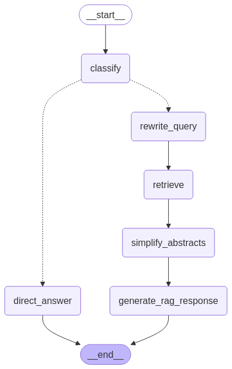

# Agentic RAG: Web-Based Retrieval-Augmented Generation System

An intelligent web application for searching and analyzing ArXiv research papers using advanced Retrieval-Augmented Generation (RAG) with Google Gemini. Features a user-friendly Streamlit interface with smart data management and query processing.

## Table of Contents
- [Agentic RAG: Web-Based Retrieval-Augmented Generation System](#agentic-rag-web-based-retrieval-augmented-generation-system)
  - [Table of Contents](#table-of-contents)
  - [Quick Start](#quick-start)
  - [Project Overview](#project-overview)
  - [Features](#features)
  - [System Architecture](#system-architecture)
  - [Installation](#installation)
  - [Environment Variables](#environment-variables)
  - [Usage](#usage)
  - [Project Structure](#project-structure)
  - [Configuration](#configuration)
  - [Performance Notes](#performance-notes)
  - [Testing](#testing)
  - [Troubleshooting](#troubleshooting)
  - [Contributing](#contributing)
  - [License](#license)

## Quick Start

1. **Install dependencies:**
   ```bash
   poetry install  # or pip install -r requirements.txt
   ```

2. **Set up environment variables:**
   ```bash
   # Create .env file with your API keys
   GEMINI_API_KEY=your_gemini_api_key
   PINECONE_API_KEY=your_pinecone_api_key
   ```

3. **Set up Kaggle authentication:**
   - Download `kaggle.json` from [Kaggle Settings](https://www.kaggle.com/settings) → API
   - Place at: `~/.kaggle/kaggle.json` (Linux/Mac) or `C:\Users\{username}\.kaggle\kaggle.json` (Windows)

3. **Launch the web application:**
   ```bash
   streamlit run streamlit_app.py
   ```

4. **First time setup:** Use the web interface to download and process ArXiv data
5. **Start querying:** Ask questions about research papers!

## Project Overview

This project provides a web-based interface for intelligent research paper search and analysis. The system combines advanced RAG techniques with Google Gemini AI to deliver accurate, contextual answers about ArXiv research papers. 

**Key Innovation:** Smart data management - the system only processes expensive data operations when you explicitly choose to, making it lightweight and cost-effective for regular use.

## Features

- **🌐 Web Interface**: Clean Streamlit app - single entry point for everything
- **📊 Real-time Progress Tracking**: Live progress bars showing current processing steps
- **🧠 Smart Data Detection**: Automatically shows data setup or query interface based on data availability
- **💰 Cost-Conscious**: No automatic expensive operations - you control when data processing happens
- **🤖 Agentic Components**: Intelligent query classification, rewriting, and processing
- **☁️ Google Gemini Integration**: All LLM operations powered by Google Gemini 2.0 Flash
- **🗃️ Vector Database**: Pinecone integration for semantic search
- **🔄 Optional Data Refresh**: Button to update data when needed
- **📝 Query History**: Track your research queries
- **⚡ GPU/CPU Support**: Automatic detection with CPU fallback
- **🎯 Smart Query Processing**: Multi-step RAG pipeline with progress feedback

## System Architecture

The agentic RAG system follows these steps with real-time progress tracking:

1. **Smart Interface**: Web app detects if processed data exists, shows appropriate interface
2. **Optional Data Pipeline**: User-triggered download and processing of ArXiv papers with detailed progress
3. **Query Classification**: Determines if query requires arXiv paper retrieval using Gemini
4. **Query Rewriting**: Generates multiple query variations for better retrieval using Gemini
5. **Document Retrieval**: Semantic search using concatenated queries with Pinecone vector database
6. **Abstract Simplification**: AI-powered simplification of complex research abstracts
7. **Response Generation**: Final answer generation using Gemini with enhanced context

**Progress Tracking Features:**
- **System Initialization**: Step-by-step loading progress with detailed status updates
- **Query Processing**: Real-time progress showing current operation (analyzing, retrieving, generating)
- **Visual Feedback**: Progress bars and status messages for all long-running operations

**Workflow Modes:**
- **First Time**: Data Pipeline Button → RAG Interface
- **Normal Use**: RAG Interface with optional refresh



## Installation

### Using Poetry (Recommended)
```bash
# Clone repository
git clone <repository-url>
cd rag_article_search

# Install dependencies
poetry install

# For GPU support (optional, faster embeddings)
poetry install --with gpu
```

### Using pip
```bash
# Clone and enter directory
git clone <repository-url>
cd rag_article_search

# Install dependencies
pip install -r requirements.txt
```

## Environment Variables

Create a `.env` file in the project root:

```env
# Required API Keys
GEMINI_API_KEY=your_gemini_api_key_here
PINECONE_API_KEY=your_pinecone_api_key_here

# Optional: Pinecone environment (if using legacy Pinecone)
PINECONE_ENVIRONMENT=your_pinecone_environment
```

**Getting API Keys:**
- **Gemini**: Get from [Google AI Studio](https://makersuite.google.com/app/apikey)
- **Pinecone**: Get from [Pinecone Console](https://app.pinecone.io/)

### Kaggle Setup (Required for Data Download)

Kaggle authentication uses the `kaggle.json` file method:

1. **Get your Kaggle API credentials:**
   - Go to [Kaggle Account Settings](https://www.kaggle.com/settings)
   - Scroll to "API" section  
   - Click "Create New Token"
   - This downloads `kaggle.json` file

2. **Place the kaggle.json file:**
   - **Windows**: `C:\Users\{username}\.kaggle\kaggle.json`
   - **Linux/Mac**: `~/.kaggle/kaggle.json`

3. **Set permissions (Linux/Mac only):**
   ```bash
   chmod 600 ~/.kaggle/kaggle.json
   ```

The `kaggle.json` file contains your username and API key in this format:
```json
{
  "username": "your_username",
  "key": "your_api_key"
}
```

## Usage

### Single Command Launch
```bash
streamlit run streamlit_app.py
```

### First Time Setup
1. Launch the web app
2. The interface will show "No processed data found"
3. Click **"Run Data Pipeline"** to download and process ArXiv papers
4. Wait for processing to complete (may take several hours)
5. Start querying!

### Normal Usage
1. Launch the web app
2. System automatically loads existing processed data with progress tracking
3. Ask questions in the query interface
4. **Real-time Progress**: Watch as the system processes your query through each step:
   - 🧠 Analyzing query...
   - 📝 Generating query variations...
   - 🔍 Retrieving relevant documents...
   - ✨ Simplifying abstracts...
   - 🤖 Generating response...
5. View comprehensive responses with:
   - **Main Response**: AI-generated answer based on research papers
   - **Query Rewrites**: See how the system expanded your question
   - **Source Documents**: Browse original and simplified abstracts
6. Optional: Click **"Refresh Data"** to update with newer papers

### Graph Visualization

Generate a visual representation of the RAG workflow graph independently:

```bash
# Generate graph visualization
python -m src.visualization.graph_viz
```

This command will:
- Load all system components (embedder, LLM, Pinecone index)
- Build the complete RAG graph workflow
- Generate a PNG visualization showing the workflow structure
- Save the output to `output/fine_tuned_rag_graph.png`

**Prerequisites for graph visualization:**
- All dependencies installed
- Valid `.env` file with `GEMINI_API_KEY`
- Pinecone index accessible
- Processed data files available (`chunked_abstracts.pkl`)

The generated graph shows the complete agentic RAG workflow including query classification, rewriting, retrieval, and response generation nodes.

## Project Structure

```
rag_article_search/
├── streamlit_app.py              # 🌐 Main web application with real-time progress tracking
├── src/                          # Core system modules
│   ├── core/                     # RAG workflow components
│   │   ├── state.py              # RAG state definition with progress callback support
│   │   ├── nodes.py              # LangGraph node functions with progress reporting
│   │   └── rag_graph.py          # Graph workflow builder
│   ├── models/                   # Model management
│   │   └── model_loader.py       # Gemini, embeddings setup
│   ├── connections/              # External service connections
│   │   ├── pinecone_db.py        # Vector database operations
│   │   └── gemini_query.py       # Google Gemini integration
│   ├── loaders/                  # Data processing utilities
│   │   ├── data_loader.py        # Dataset management
│   │   └── embedding.py          # Embedding operations
│   └── visualization/            # Graph visualization
│       └── graph_viz.py          # Workflow visualization
├── scripts/                      # Background processing (used by web app)
│   ├── get_data_pipeline.py      # Data download and processing
│   └── run_agentic_llm.py        # RAG system components
├── config/                       # Configuration
│   └── config.yaml               # System settings
├── test/                         # Test suite
├── data/                         # Processed data storage
├── output/                       # Results and visualizations
├── requirements.txt              # Dependencies
├── pyproject.toml                # Poetry configuration
└── README.md                     # This file
```

## Configuration

The system uses `config/config.yaml` for all settings. Key configurations:

```yaml
# Data Processing
dataset_kaggle: "Cornell-University/arxiv"
date: "2021-10-01"  # Filter papers after this date
chunk_size: 2000
chunk_overlap: 200

# Embeddings
fast_embed_name: "BAAI/bge-small-en-v1.5"
ch_batch_size: 256

# RAG System
gemini_model_name: "gemini-2.0-flash"
top_k: 5

# Vector Database
pc_index: "abstract-index"
distance_metric: "cosine"
```

## Performance Notes

### Real-time Progress Tracking
- **Callback-based System**: Progress updates happen in real-time as each processing step begins
- **Visual Feedback**: Clear progress bars with descriptive status messages
- **No Time Simulation**: Progress reflects actual system operations, not time estimates
- **Step-by-step Updates**: Users see exactly what the system is doing at each moment

### GPU vs CPU
- **GPU (CUDA)**: ~10x faster embeddings, requires `onnxruntime-gpu`
- **CPU**: Slower but works everywhere, automatic fallback
- **Detection**: System automatically uses best available option

### Data Processing Time
- **Full ArXiv Dataset**: ~2M papers, several hours to process
- **Filtered Dataset**: ~500K papers (2021-present)
- **Selected Sample**: 10K chunks for demonstration

### Memory Requirements
- **Data Pipeline**: ~8GB RAM recommended
- **RAG Queries**: ~2GB RAM for inference
- **Storage**: ~10GB for processed data
     agentic-rag
   ```

### Development with Docker

For development with live code changes:

```bash
# Start development environment
docker-compose --profile dev up agentic-rag-dev

# Or run specific commands
docker-compose run --rm agentic-rag-dev python download_filter_embed_upsert.py
```

## Configuration

The system is configured through `config/config.yaml`:

```yaml
# Model Configuration  
gemini_model_name: "gemini-2.0-flash"
fast_embed_name: "BAAI/bge-small-en-v1.5"
top_k: 5

# Database Configuration
pc_index: "abstract-index"
## Testing

Run the test suite to verify system functionality:

```bash
# Using Poetry
poetry run pytest

# Using pip
pytest

# Run specific tests
pytest test/test_core/
pytest test/test_loaders/

# Run with coverage
pytest --cov=src
```

The test suite covers:
- Core RAG functionality
- Data loading and processing  
- Model integration
- API connections

## Troubleshooting

### Common Issues

1. **"No processed data found"**
   - Solution: Click "Run Data Pipeline" in the web interface
   - First-time setup requires data download and processing
   - Watch the detailed progress bar during processing

2. **Progress tracking not updating**
   - Solution: This should now be fixed with real-time callback-based progress
   - Progress updates show current operation, not completed operations
   - If still not working, check console logs for error messages

3. **"CUDA not available" or slow embeddings**
   - Solution: Install GPU support: `poetry install --with gpu`
   - Or accept CPU processing (slower but works)

4. **API Key errors**
   - Solution: Check your `.env` file has all required keys
   - Verify keys are valid and have sufficient quota

5. **Kaggle authentication failed**
   - **Solution**: Ensure `kaggle.json` is in the correct location
   - **Windows**: `C:\Users\{username}\.kaggle\kaggle.json`
   - **Linux/Mac**: `~/.kaggle/kaggle.json`
   - **Get credentials**: [Kaggle Account Settings](https://www.kaggle.com/settings) → API → Create New Token
   - **Permissions**: Run `chmod 600 ~/.kaggle/kaggle.json` (Linux/Mac)

5. **"Kaggle credentials not found" error**
   - **Solution**: Check that `kaggle.json` exists in `~/.kaggle/` directory
   - **Content should be**: `{"username": "your_username", "key": "your_api_key"}`
   - **Alternative**: The system will show clear error message with instructions

5. **Memory errors during data processing**
   - Solution: Reduce batch sizes in `config/config.yaml`:
     ```yaml
     ch_batch_size: 128  # Reduce from 256
     pc_batch_size: 250  # Reduce from 500
     ```

6. **Streamlit app won't start**
   - Solution: `pip install streamlit` or `poetry install`
   - Check Python version (3.11+ required)

7. **pandas type errors**
   - Solution: These are usually type checker warnings, not runtime errors
   - The code should still work despite Pylance/mypy warnings

8. **Graph visualization fails**
   - Solution: Ensure all components are properly configured
   - Check that processed data exists (`chunked_abstracts.pkl` in data directory)
   - Verify API keys and Pinecone connectivity
   - The visualization requires the same setup as the main RAG system

### Getting Help

1. Check the web interface status sidebar for dependency issues
2. View logs in terminal where you launched the app  
3. Verify all environment variables are set correctly
4. Ensure sufficient disk space for data processing

## Contributing

1. Fork the repository
2. Create a feature branch (`git checkout -b feature/amazing-feature`)
3. Commit changes (`git commit -m 'Add amazing feature'`)
4. Push to branch (`git push origin feature/amazing-feature`)
5. Open a Pull Request

## License

This project is licensed under the MIT License. See the `LICENSE` file for details.