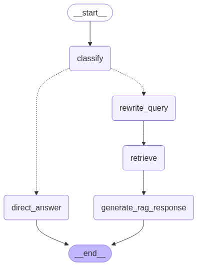

# Agentic RAG

## Data Location
The data is the **[arXiv Dataset in Kaggle](https://www.kaggle.com/datasets/Cornell-University/arxiv)**.

`download_filter_embed_upsert.py` will automatically download this for you.

### Kaggle Account
1. To download the data, you will need to have a Kaggle Account.
2. Obtain the Kaggle API JSON file and paste it into your `.kaggle/` directory
    - Steps are located **[here](https://www.kaggle.com/docs/api#authentication)**


## Prerequisites
I have included both Docker and Virtual Environment setups.

### API Keys
You will need a **[Pinecone](https://www.pinecone.io/)** account and an **[OpenAI](https://openai.com/)** account for their API keys.

Please ensure that you have a `.env` file in the project root directory that has:
```
PINECONE_API_KEY=<YOUR API KEY HERE>
OPENAI_API_KEY=<YOUR API KEY HERE>
```


### Python download
Ensure you have **[Python](https://www.python.org/downloads/)** installed on your system.

### Virtual Environment Setup
You can set up a virtual environment to manage packages. Here, I am using **[Anaconda](https://docs.conda.io/projects/conda/en/stable/user-guide/install/index.html)**
1. create a virtual environment.
    ```
    conda create -n rag python=3.11.11
    ```
2. Next, activate.
    ```
    conda activate rag
    ```
3. Install Pip
    ```
    conda install pip
    ```

Finally, install packages.

#### Package Installation
Please ensure that you have a CUDA version installed on your system. 

Install required dependencies by running in terminal:
```
pip install -r requirements.txt
```
NOTE: The `kaggle` and `kagglehub` packages are required for downloading the data.

You may need to run the below to allow NVIDIA GPU usage the cpu version (`onnxruntime`) was installed
```
pip uninstall onnxruntime onnxruntime-gpu
pip install onnxruntime-gpu --extra-index-url https://aiinfra.pkgs.visualstudio.com/PublicPackages/_packaging/onnxruntime-cuda-12/pypi/simple/
```
Make sure you install based off of your CUDA version. More info **[here](https://onnxruntime.ai/docs/install/)**.

### Docker Setup
NOTE: The `Dockerfile` expects only the sample data for `unit_test.py`. Please make sure you download the data from **[Google Drive](https://drive.google.com/file/d/1lHBblDVIfiznS92sUo1R_ArojrifzaJR/view?usp=sharing)** before building the docker image. The Dockerfile does not pull in the full dataset.

1. Open up terminal in the project directory
    ```
    cd stitching-project-reigningforest/
    ```
2. Build the docker image, naming based off of user/docker_test1 and using directory assignment-3-reigningforest
    ```
    docker build -t kek6109/stitching-project ~/stitching-project-reigningforest
    ```
3. (Optional) Search to see docker image creation
    ```
    docker images | grep kek6109
    ```
4. Run the docker image to create the container
    You will need to create a data/ and output/ directory in the project directory
    
    **My docker image is on Deepdish 4 and is named: kek6109/assign4**
    ```
    docker run -it \
      --mount type=bind,src=/nfs/home/kek6109/stitching-project-reigningforest/data/,dst=/home/data/ \
      --mount type=bind,src=/nfs/home/kek6109/stitching-project-reigningforest/output/,dst=/home/output/ \
      --mount type=bind,src=/nfs/home/kek6109/stitching-project-reigningforest/models/,dst=/home/models/ \
      kek6109/stitching-project \
      /bin/bash
    ```
5. When in `/home/`, input API Keys
    ```
    export OPENAI_API_KEY=<YOUR API KEY HERE>
    export PINECONE_API_KEY=<YOUR API KEY HERE>
    ```


### Directory Setup
NOTE: You will need to manually create these directories if building a docker image.

Please note that you should only use:
1. A `data` folder to store and retrieve data.
    - This is automatically generated by `download_filter_embed_upsert.py`
2. An `output` folder to store outputs.
    - This is automatically generated by any of the files that create outputs (e.g., `unit_test.py`)

## Usage
All the below code should be run in terminal under the root directory of the project.

### Data Preparation
1. Run `download_filter_embed_upsert.py` to download, filter, embed, and upsert data.
    - The following files will be created and stored under the data folder.
        - `arxiv-metadata-oai-snapshot.json`
        - `filtered_abstracts.pkl`
        - `chunked_abstracts.pkl`
        - `embeddings_final.npy`
    - Additionally, the following files will be created as well for the unit test. These files are restricted to 10,000 samples for the `unit_test_prep.py` and `unit_test.py` code.
        - `chunks_selected.pkl`
        - `embeddings_selected.npy`

### Interactive Usage
1. Run `base_llm.py` to interact with the base ChatGPT 3.5 Turbo LLM.
2. Run `base_rag.py` to interact with the base ChatGPT 3.5 Turbo LLM augmented with retrieved documents.
3. Run `agentic_rag.py` to interact with the AgenticAI that uses a classifier, a query rewriter, and an abstract retrieval system to augment the base prompt.
    - Produces the `base_rag_graph.png`.

    
4. Run `agentic_rag_finetune.py` to interact with the AgenticAI that uses a classifier, a query rewriter, an abstract retrieval system, and an abstract simplifier to augment the base prompt.
    - Produces the `fine_tuned_rag_graph.png`
    
    

The Agentic RAG with Finetuning uses ChatGPT 3.5 Turbo with:
- classification query to determine whether the RAG is needed or not
- A rewriting query to generate additonal queries from the original query
- A retrieval system to retrieve relevant abstracts from the Pinecone database for context using the concatenated query and rewrites
    - e.g., the query and 2 rewrites are combined and embedded. Then, the top 5 similar abstracts are retrieved.
- A small finetuned Huggingface model finetuned to simplify the retrieved abstracts and keeps both the original and the simplified abstracts
- The final query which combines the queries and the original and simplified abstracts to obtain the response
- Otherwise, the question is directly answered by the LLM with no further context added


### Batch Processing
1. Run `batch_processor.py` to get 5 default questions and answers from the above `.py` files.
    - Creates `batch_results_[date_time].txt` with query and answer.

### Unit Test
1. Download and unzip sample data (10,000 samples) from **[Google Drive](https://drive.google.com/file/d/1lHBblDVIfiznS92sUo1R_ArojrifzaJR/view?usp=sharing)**
2. Run the docker image and export the API keys (specific instructions in above sections).
3. Run `unit_test_prep.py` to upsert the data to pinecone.
4. Run `unit_test.py` to run the fine tuned Agentic AI model on the queries in `prompts.txt`.
    - The main difference is that it uses a sample of the abstracts and only generates 1 query
    - Creates `unit_test_results.txt` with query and answer.

### Comments/sample ouputs
Comments on sample outputs is in the `outputs/` folder. It is called `sample_output_comments.docx`.